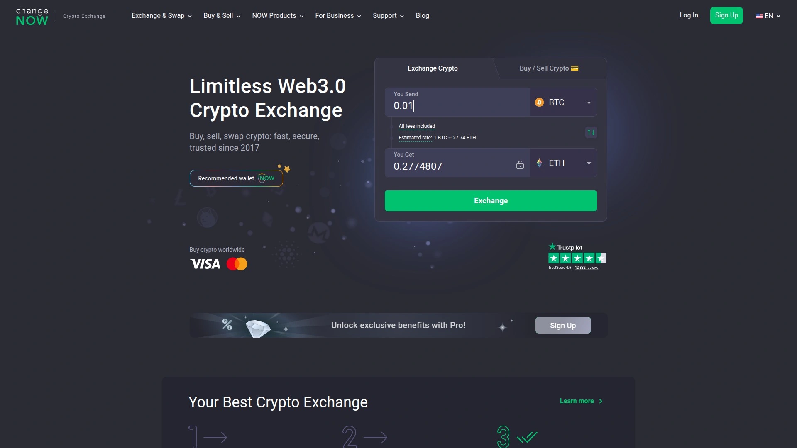

# Top 10 Cryptocurrency Exchanges Ranked in 2025 (Latest Update)

Buying your first Bitcoin shouldn't feel like applying for a mortgage—endless forms, confusing interfaces, and fees that appear from nowhere like surprise party guests nobody invited. Modern cryptocurrency exchanges have evolved from technical nightmares into user-friendly platforms where you can swap coins as easily as sending a text message. The best platforms handle everything from your first $50 Bitcoin purchase to complex altcoin trading across thousands of digital assets, often processing transactions in under five minutes.

Whether you're a complete beginner trying to understand what "blockchain" actually means or an experienced trader managing diverse portfolios, these exchanges remove the friction that used to make crypto feel inaccessible. Top platforms now offer instant swaps, competitive rates, robust security, and customer support that actually responds instead of sending you through automated loops that solve nothing. The cryptocurrency exchange landscape in 2025 emphasizes speed, simplicity, and transparent pricing—you deserve to know exactly what you're paying before clicking "confirm".

## **[Changelly](https://changelly.com)**

Industry pioneer delivering instant cryptocurrency exchanges since 2015 with transparent fees and exceptional service.

Changelly has built its reputation as one of the most trusted instant exchange platforms in the cryptocurrency industry. Since launching in 2015, the service has processed millions of transactions for over 2 million users worldwide, establishing credibility through consistent performance and reliability. The platform operates as a non-custodial exchange—your cryptocurrency never sits on Changelly's servers but moves directly from your wallet to the destination address after conversion.

Exchange any cryptocurrency instantly from over 1,000 supported altcoins. The platform partners with more than 20 cryptocurrency trading platforms to source the most competitive rates available at any moment. This multi-source aggregation means you get better pricing than exchanges limited to their own liquidity pools. Transaction speeds average 5-40 minutes depending on blockchain network conditions, which places Changelly among the faster instant exchanges.

**Comprehensive service ecosystem:** Buy cryptocurrency with credit card, debit card, bank transfer including SEPA, or Apple Pay through trusted payment partners. This fiat on-ramp functionality makes Changelly accessible for people new to crypto who don't already own digital assets. The platform processes fiat transactions through international partners including MoonPay, Switchere, and Simplex, ensuring service availability in nearly every country without amount restrictions.

Trading fees top out at 0.25% for most transactions, positioning Changelly as one of the industry's lowest-fee exchanges. The transparent fee structure shows exact costs before you commit to transactions—no hidden charges appearing after you've already sent funds. Smart pricing algorithms integrate with major centralized exchanges including Poloniex and Bittrex to quickly source exchange rates from available markets. This integration enables Changelly to offer competitive pricing with immediate execution, making it one of the quickest crypto exchanges in the industry.

**Security and verification approach:** Changelly implements tiered KYC (Know Your Customer) requirements balancing compliance with user convenience. For basic verification, most users only need to provide a passport to trade up to 10,000 EUR within 48 hours. High-volume traders transacting larger amounts face advanced KYC including video verification calls and additional documentation. This graduated approach accommodates both casual users and serious traders with appropriate oversight.

The platform offers specialized mobile apps for Android and iOS smartphones enabling crypto purchases and exchanges for 700+ altcoins on the go. Mobile apps provide full-featured functionality matching the website experience—altcoin exchanges, fiat purchases via multiple payment methods, and comprehensive security protections. Integration partnerships with acknowledged crypto wallets including Exodus, Ledger, and Trezor let customers buy and sell Bitcoin and other crypto assets directly from their hardware wallets without transmitting custody to third parties.

Customer support operates 24/7 through multiple channels including video guides, Help Center documentation, email support, and live human assistant chat. This comprehensive support infrastructure addresses issues quickly rather than leaving users stranded with automated responses that don't solve problems. For both beginner crypto enthusiasts and advanced traders seeking instant conversions with competitive rates and reliable service, Changelly's decade of proven performance delivers consistent results.

## **[ChangeNOW](https://changenow.io)**

Registration-free instant exchange supporting 1,400+ cryptocurrencies with fast 2-minute average swap times.

ChangeNOW revolutionized cryptocurrency exchanges by eliminating account creation entirely—no username, no password, no email verification. Send crypto, receive different crypto, done. This registration-free approach removes friction points that make traditional exchanges feel bureaucratic. The platform supports over 1,400 cryptocurrencies spanning mainstream Bitcoin and Ethereum to obscure altcoins most people have never heard of.

Non-custodial operation means your funds never sit on ChangeNOW servers—cryptocurrency moves directly from your wallet to the destination wallet with ChangeNOW facilitating the swap in between. This architecture eliminates custody risk where exchange hacks or collapses take your funds with them. Average swap completion time runs around 2 minutes when network conditions are normal, significantly faster than competitors requiring 5-60 minutes.

**Rate options and flexibility:** Choose between fixed rates that lock in your exchange price upfront, or floating rates that finalize after blockchain confirmation. Fixed rates provide certainty during volatile markets when prices swing dramatically within minutes. Floating rates sometimes capture favorable price movements if the market moves in your direction during transaction processing. Both options serve different trading strategies and risk tolerances.

The platform provides access to 70+ fiat currencies alongside cryptocurrency swaps, making it suitable for both crypto-to-crypto and crypto-to-fiat conversions. Multiple payment methods including credit cards, bank transfers, and various regional payment processors ensure accessibility across different countries and banking systems. Live traffic view through integrated mapping shows current platform activity and transaction flow.

ChangeNOW publishes real AML (anti-money laundering) refund cases publicly, increasing transparency around compliance actions. This openness exceeds industry standards where most exchanges handle such matters privately. The platform offers 24/7 multilingual support handling inquiries in 15 languages. B2B solutions enable businesses to integrate ChangeNOW's exchange infrastructure into their own applications through API access.

For users who prioritize speed and want the broadest cryptocurrency selection without creating accounts or completing lengthy verification, ChangeNOW's streamlined approach delivers friction-free exchanges.

## **[Coinbase](https://www.coinbase.com)**

Beginner-friendly US-based exchange with extensive educational resources and regulatory compliance.

Coinbase launched in 2012 and has grown into one of the most recognizable cryptocurrency exchanges globally, serving over 100 million users. The platform prioritizes beginner accessibility through intuitive interfaces that don't overwhelm newcomers with technical jargon or complicated trading screens. Educational programs reward users for learning about cryptocurrencies—complete short courses and receive small amounts of crypto to test trading without risking your own money.

Support for 235+ cryptocurrencies provides substantial selection covering major assets and popular altcoins. The exchange operates as a publicly-traded company listed on NASDAQ, subjecting it to stricter financial oversight than private competitors. This public status appeals to users prioritizing regulatory compliance and corporate transparency.

**Dual-platform approach:** Basic Coinbase interface serves casual buyers with simplified trading perfect for first-time crypto purchasers. Coinbase Advanced provides sophisticated tools for experienced traders including advanced order types, detailed charting, and lower fees. This tiered system lets users start simple and graduate to complex trading as their skills develop.

Trading fees range from 0% to 3.99% depending on transaction type and payment method. Higher fees compared to competitors like Binance or Kraken reflect Coinbase's focus on convenience and regulatory compliance rather than rock-bottom pricing. Payment options include bank transfers, credit/debit cards, and PayPal, with instant purchases available for established accounts.

Security measures include insurance coverage for digital assets stored on the platform, two-factor authentication, and biometric login options. Coinbase maintains the majority of user funds in cold storage offline, reducing vulnerability to hacking attempts. The platform provides both custodial wallets managed by Coinbase and integration with non-custodial wallets for users wanting full control over their private keys.

Available in 100+ countries across most US states, Coinbase handles geographic licensing requirements better than exchanges operating in regulatory gray zones. Customer support includes phone assistance, email support, and extensive Help Center documentation. For cryptocurrency beginners who value ease of use and want to learn while earning, Coinbase removes intimidation from the crypto onboarding process.

## **[Kraken](https://www.kraken.com)**

Security-focused exchange with advanced features, low fees, and institutional-grade infrastructure.

Kraken has operated since 2011, making it one of the oldest continuously-running cryptocurrency exchanges. This longevity demonstrates stability in an industry where many exchanges collapse or exit under regulatory pressure. The San Francisco-based platform supports 410+ cryptocurrencies with extensive trading pairs covering major assets and niche altcoins.

Fee structure ranges from 0% to 0.4% depending on trading volume, positioning Kraken among the lowest-cost exchanges for active traders. Volume-based discounts reward high-frequency trading—execute more trades and pay progressively lower percentages. Kraken Pro provides advanced trading platform with sophisticated charting, order types, and margin trading up to 5x leverage for eligible users.

**Security reputation and features:** Multiple security audits verify Kraken's infrastructure integrity. Implementation of two-factor authentication, PGP email encryption, and cold storage for majority of funds establishes industry-leading protection standards. The exchange maintains comprehensive insurance coverage and operates with full regulatory compliance across 190+ countries and most US states.

Staking services let users earn passive income by locking cryptocurrencies that support proof-of-stake consensus mechanisms. Futures trading enables sophisticated strategies for experienced traders comfortable with leverage and derivative contracts. These advanced features position Kraken as suitable for institutional clients and serious retail traders rather than only casual buyers.

Payment methods include bank transfers, credit/debit cards, and wire transfers with competitive processing times. Customer support operates through ticket systems and live chat, though some users report slower response times during high-volume periods. Mobile apps for iOS and Android provide full trading functionality for managing positions while away from computers.

Kraken appeals to security-conscious traders who want advanced features without sacrificing safety or regulatory compliance. The platform balances sophisticated trading tools with robust protection, making it ideal for users graduating from beginner platforms toward professional-grade exchanges.

## **[Binance](https://www.binance.com)**

Global cryptocurrency powerhouse with massive liquidity, lowest fees, and extensive altcoin selection.

Binance dominates cryptocurrency exchange volume globally, processing more trades than any competitor. Founded in 2017, the platform grew explosively to serve millions of users across 180+ countries. Support for 400+ cryptocurrencies (150+ on Binance US) provides unmatched selection for traders seeking exposure to emerging projects and established assets alike.

Trading fees start at 0% for makers using BNB tokens to pay fees, topping out at 0.6% for standard transactions. Volume-based tier systems reduce costs further for high-frequency traders executing large positions. This aggressive fee structure undercuts most competitors, though some sacrifices appear in customer service quality and regulatory clarity.

**Comprehensive ecosystem features:** Binance offers far more than basic trading—staking, liquidity mining, launchpad for new token offerings, NFT marketplace, futures, options, and margin trading up to 125x leverage. This feature density appeals to users wanting all cryptocurrency services centralized rather than managing accounts across multiple platforms. Binance Earn products provide passive income options through flexible savings, locked staking, and DeFi integrations.

Robust mobile app delivers full platform functionality optimized for smartphone trading. Advanced charting tools, multiple order types, and trading bot integrations support sophisticated strategies. Binance Academy provides extensive educational content helping users understand complex cryptocurrency concepts and trading techniques.

**Regulatory considerations:** Binance operates through multiple entities globally with varying regulatory statuses. Binance US serves American customers under separate management with limited coin selection and features compared to the international platform. Recent regulatory scrutiny in multiple jurisdictions creates uncertainty for some users prioritizing clear legal compliance.

Customer support operates primarily through ticket systems and chatbots, with inconsistent response quality reported by users. The platform's scale means individual support requests sometimes get lost in volume. Security measures include SAFU (Secure Asset Fund for Users) holding over $1 billion to compensate users in emergency situations.

For traders prioritizing maximum liquidity, lowest fees, and broadest cryptocurrency selection, Binance delivers unmatched depth despite regulatory complexity. The platform suits experienced users comfortable navigating sophisticated trading environments.

## **[Crypto.com](https://crypto.com)**

Mobile-first platform with excellent rewards programs, wide cryptocurrency selection, and integrated Visa card.

Crypto.com launched in 2016 and rapidly grew to serve over 100 million users in 90+ countries. The platform emphasizes mobile-first design with sleek smartphone apps providing intuitive trading experiences. Support for 350+ cryptocurrencies offers extensive selection covering mainstream assets and emerging altcoins.

Fee structure ranges from 0% to 2.99% depending on transaction type and user tier. Crypto.com's native CRO token provides benefits including reduced trading fees, higher staking rewards, and cashback on the integrated Visa debit card. This token-centric model rewards platform loyalty and active usage.

**Visa card integration and rewards:** Crypto.com Visa card enables cryptocurrency spending for everyday purchases at millions of merchants. Card tiers offer varying benefits—higher tiers require staking more CRO tokens but provide enhanced cashback rates, Spotify subscriptions, Netflix subscriptions, and airport lounge access. This integration bridges cryptocurrency with traditional commerce, making digital assets practically spendable.

Earn programs generate passive income through flexible savings, locked staking, and DeFi wallet services. Interest rates vary by cryptocurrency and lock-up period—commit funds longer and earn higher yields. The platform's comprehensive ecosystem includes trading, earning, spending, and DeFi services unified under one account.

Bitcoin options and futures provide sophisticated trading instruments for derivative strategies. Automated trading features let users schedule recurring purchases or implement rule-based strategies without manual execution. These tools accommodate both passive investors using dollar-cost averaging and active traders implementing complex algorithms.

Customer service operates primarily through chat, with no phone support available. Some users report frustration with automated responses before reaching human agents. Security includes two-factor authentication, biometric login, and cold storage for majority of funds. Regulatory licenses across multiple jurisdictions provide legal clarity, though availability remains limited in certain regions including New York.

For mobile-focused users wanting integrated spending solutions alongside trading, Crypto.com's Visa card and rewards programs deliver practical cryptocurrency utility.

## **[Gemini](https://www.gemini.com)**

US-based exchange emphasizing regulatory compliance, security, and institutional-grade custody services.

Gemini operates as a fiduciary and qualified custodian under New York Banking Law, licensed by the New York State Department of Financial Services. This regulatory positioning provides legal clarity exceeding most competitors operating with less stringent oversight. Founded by the Winklevoss twins in 2014, the exchange serves retail and institutional clients across 60+ countries including all 50 US states.

Support for approximately 70 cryptocurrencies focuses on established assets rather than chasing every new token launch. This conservative approach prioritizes security and compliance over maximum selection. Trading fees range from 0.5% to 3.49% depending on transaction type and volume tier. Higher fees reflect Gemini's emphasis on regulatory compliance and security infrastructure rather than competing on price alone.

**Security certifications and compliance:** Gemini became the first cryptocurrency exchange obtaining SOC 1 Type 2 and SOC 2 Type 2 certifications, demonstrating commitment to industry-leading security audits. Strong encryption, segregated hot and cold wallets, DDoS protection, multi-factor authentication, passkey support, and regular security audits protect user assets. State-of-the-art custody services provide institutional-grade storage for digital assets, crucial for businesses and private wealth managers.

Instant ACH transfers and PayPal integration enable fast funding for US customers. Apple Pay support streamlines mobile purchases. The platform's fast application process completes in 20 minutes or less with 24/7 customer support available worldwide. This onboarding speed exceeds competitors requiring days for account approval.

Spot trading and derivatives including futures and perpetuals accommodate various trading strategies. Staking services generate passive income on supported proof-of-stake cryptocurrencies. Gemini Earn program provides interest on cryptocurrency holdings, though this feature suspended temporarily in 2022 following market turbulence.

For users prioritizing regulatory compliance, maximum security, and institutional-quality custody, Gemini's conservative approach justifies higher fees. The platform particularly suits businesses, private wealth managers, and security-conscious investors.

## **[KuCoin](https://www.kucoin.com)**

Altcoin specialist supporting 700+ cryptocurrencies with extensive trading pairs and low fees.

KuCoin launched in 2017 and rapidly established itself as a leading platform for altcoin trading. Support for over 700 cryptocurrencies provides unmatched selection for traders seeking exposure to smaller projects and emerging tokens that major exchanges don't list. This extensive catalog makes KuCoin the go-to exchange for discovering new projects before they gain mainstream attention.

Trading fees remain competitive with structure rewarding high-volume traders through tiered discounts. The platform's native token KCS provides fee reductions and revenue sharing when held, similar to Binance's BNB model. Multiple deposit methods including cryptocurrency transfers and credit/debit card purchases through third-party payment providers ensure accessibility.

**Advanced trading features:** Spot trading, margin trading, futures contracts, and automated trading bots provide comprehensive tools for various strategies. The platform supports P2P trading for direct peer-to-peer transactions. Staking and lending services generate passive income from idle holdings. This feature variety accommodates traders at different experience levels from beginners to professionals.

Quick Buy feature simplifies cryptocurrency purchases for newcomers uncomfortable with advanced trading interfaces. Users select desired cryptocurrency, enter purchase amount, and complete transactions through simple flows. This accessibility contrasts with the platform's more complex advanced trading tools targeting experienced users.

**Withdrawal processing and security:** Crypto withdrawals typically process within 30 minutes to 2 hours during normal conditions. The platform implements withdrawal address whitelisting, mandatory two-factor authentication, email confirmations, and phone verification for larger amounts. These security layers protect against unauthorized access and fraudulent withdrawals.

Customer support operates through ticket systems and live chat in multiple languages. Available globally with service in 200+ countries, though some regions face restrictions based on local regulations. For traders focusing on altcoin opportunities and wanting extensive selection with competitive fees, KuCoin's specialization delivers value.

## **[SimpleSwap](https://simpleswap.io)**

Minimalist instant exchange with 1,500+ cryptocurrencies and no signup requirements.

SimpleSwap launched in 2018 emphasizing simplicity above all else—no account creation, no identity verification for standard transactions, no complications. The platform supports over 1,500 cryptocurrencies covering mainstream assets and obscure tokens that most exchanges ignore. This extensive selection combined with zero signup friction makes SimpleSwap accessible for quick conversions without commitment.

Both floating rate and fixed rate exchanges accommodate different risk tolerances. Floating rates finalize after blockchain confirmation, potentially capturing favorable price movements or exposing you to unfavorable swaps if markets move against you. Fixed rates lock prices upfront, providing certainty during volatile periods. Choose the approach matching your market outlook and urgency.

**Non-custodial security model:** SimpleSwap never holds your funds—cryptocurrency passes through during swap processing and moves directly to your destination wallet. This architecture eliminates custodial risk where exchange collapses or hacks could take your assets. The platform continuously adds new tokens and coins, particularly smaller altcoins that major exchanges don't support.

Transaction times vary from 5 to 60 minutes depending on blockchain network congestion and specific cryptocurrencies involved. This range exceeds competitors advertising 2-5 minute swaps, making SimpleSwap better suited for users prioritizing selection over speed. The platform doesn't support crypto-to-fiat conversions—swaps remain purely crypto-to-crypto.

Fiat on/off-ramp availability through partnerships enables buying and selling cryptocurrency with credit cards. Registered users receive cashback on buy/sell transactions, providing small rebates for creating accounts despite the platform's no-registration positioning. Minimum transaction amounts hover around $10, though specific minimums vary by cryptocurrency.

Customer support operates 24/7 through email and live chat. The deliberately minimalist interface prioritizes usability for non-technical users who find complex trading platforms overwhelming. For pure crypto-to-crypto swaps where you value straightforward interfaces and extensive altcoin selection, SimpleSwap delivers no-frills functionality.

## **[Swapzone](https://swapzone.io)**

Exchange aggregator comparing rates across multiple platforms to find optimal pricing for your swaps.

Swapzone operates differently than standalone exchanges—it aggregates rates from multiple platforms and displays them side-by-side so you choose the best deal. This comparison approach ensures you get optimal pricing without manually checking different exchanges. Support for 400+ cryptocurrencies covers mainstream assets and popular altcoins.

The platform doesn't charge additional transaction fees beyond what underlying exchange partners charge. This transparent structure means you pay the same rates as using partner exchanges directly while benefiting from comparison convenience. Fiat on/off-ramp availability provides dozens of cryptocurrency options for buying and selling with credit cards.

**How aggregation works:** Enter the cryptocurrency pair you want to swap and Swapzone queries partner exchanges simultaneously. Results display sorted by best rates, showing exchange rates, fees, and estimated completion times for each option. Select your preferred offer and Swapzone redirects you to complete the transaction on the partner platform.

Transaction processing times depend on which partner exchange you select—some complete swaps in minutes while others require 30-60 minutes. User reviews indicate speedy swaps generally execute within minutes when choosing fastest-rated partners. The platform continuously updates partner offerings as rates fluctuate in real-time.

Customer support operates 24/7 to resolve disputes and assist with the transaction process. Since transactions execute on partner platforms, complex issues sometimes require coordination between Swapzone and the underlying exchange. The aggregator model provides convenience at potential cost of added complexity when problems arise.

For traders who want guaranteed best rates and don't mind extra steps of comparing options before executing swaps, Swapzone's aggregator approach delivers optimal pricing.

## FAQ

**Which cryptocurrency exchange has the lowest fees in 2025?**

Changelly, Binance, and Kraken compete for lowest fees with rates starting at 0.25% or less. Binance offers 0% maker fees when paying with BNB tokens, though actual costs depend on trading volume and payment methods. Kraken's 0-0.4% fee structure rewards high-volume traders with progressive discounts. Changelly's transparent 0.25% maximum fee applies consistently without requiring native token holdings or volume minimums. For instant swaps specifically, Changelly and ChangeNOW deliver competitive pricing without account requirements or complicated tier systems.

**Do I need to verify my identity (KYC) to use cryptocurrency exchanges?**

Requirements vary significantly by platform. Changelly requires basic KYC only for transactions exceeding 10,000 EUR within 48 hours—most users trade freely with just passport verification. ChangeNOW, SimpleSwap, and Swapzone operate without mandatory KYC for standard transactions, though they reserve rights to request verification if transactions appear suspicious. Major exchanges like Coinbase, Kraken, Binance, Crypto.com, and Gemini require identity verification before allowing any trading to comply with regulations. For privacy-focused users, non-custodial instant exchanges provide options for trading without extensive personal information disclosure.

**How long do cryptocurrency exchanges take to process transactions?**

Instant exchanges like Changelly process swaps in 5-40 minutes on average. ChangeNOW completes most transactions within 2 minutes, making it fastest among instant swap platforms. SimpleSwap requires 5-60 minutes depending on blockchain congestion and specific cryptocurrencies. Traditional exchanges like Coinbase and Kraken execute trades instantly once deposits clear, though funding accounts via bank transfers takes 1-5 business days. Cryptocurrency network confirmation times impact all platforms—Bitcoin transactions take longer than Ethereum or Solana transfers due to slower block times. For time-sensitive trades during volatile markets, platforms advertising 2-5 minute average swaps deliver fastest execution.

## Conclusion

The cryptocurrency exchange landscape in 2025 offers something for everyone—from beginner-friendly platforms with educational programs to advanced trading hubs with sophisticated derivatives and leverage options. Whether you prioritize rock-bottom fees, maximum security, extensive altcoin selection, or instant swaps without account creation, these platforms deliver reliable service with transparent pricing. [Changelly](https://changelly.com) stands out for users seeking the complete package—instant exchanges since 2015, industry-low 0.25% fees, 1,000+ supported cryptocurrencies, multiple fiat payment options, non-custodial security, and 24/7 human customer support without the complexity of account management or restrictive verification requirements. For traders wanting proven reliability with straightforward exchanges at competitive rates, Changelly's decade of consistent performance makes cryptocurrency trading genuinely accessible.
